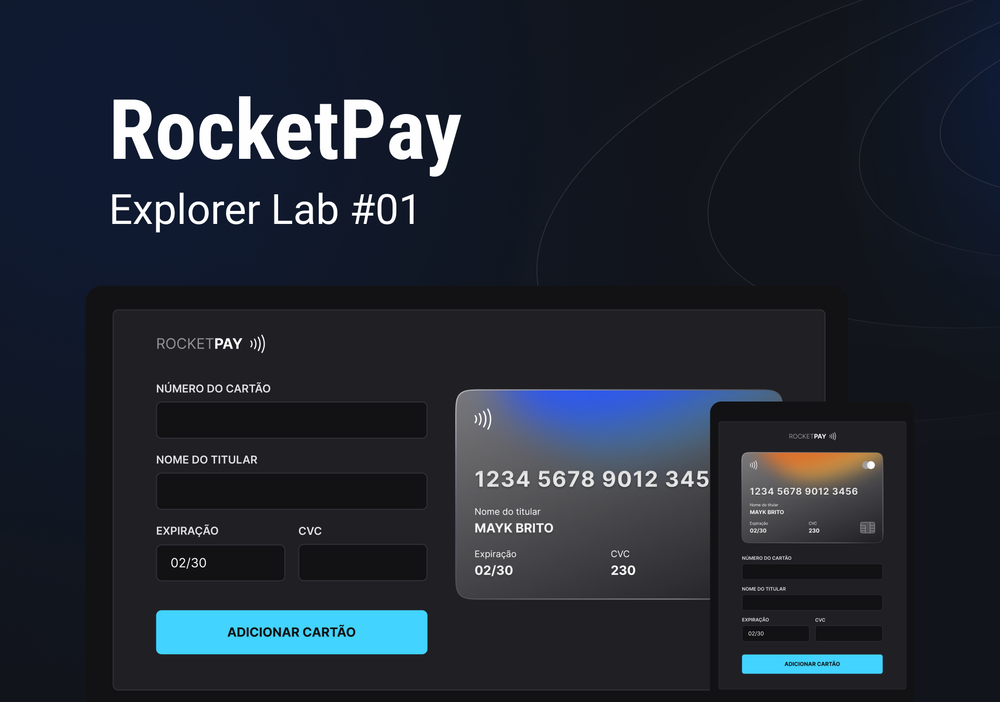

<div align="center">
  
  <h3>Explorer lab #01</h3>
</div>
<br/>
<div align="center">
   <a href="https://github.com/mathrb22">
      
   </a>
   
   
   <a href="https://github.com/mathrb22/explorer-lab-rocketpay/commits/main">
      
   </a>
   <a href="https://github.com/mathrb22/explorer-lab-rocketpay/issues">
      
   </a>
   <a href="https://github.com/mathrb22/explorer-lab-rocketpay/pulls">
      
   </a>
   </br>
   </br>
   <a href="#-tecnologias-utilizadas">
      
     
   </a>
</div>
 </br>
<div align="center">

[**Sobre**](#-sobre) &nbsp;&nbsp;**|**&nbsp;&nbsp;
[**Tecnologias**](#-tecnologias) &nbsp;&nbsp;**|**&nbsp;&nbsp;
[**Layout**](#-layout) &nbsp;&nbsp;**|**&nbsp;&nbsp;
[**Instalação e execução**](#-instalação-e-execução) &nbsp;&nbsp;**|**&nbsp;&nbsp;
[**Como contribuir**](#-como-contribuir) &nbsp;&nbsp;**|**&nbsp;&nbsp;
[**Contato**](#-contato) &nbsp;&nbsp;**|**&nbsp;&nbsp;
[**Licença**](#-licença)

</div>

## 📃 Sobre



O Rocketpay é um componente que simula o formulário de preenchimento de cartão de crédito, onde é possível adicionar máscara aos inputs e atualizar elementos HTML via DOM.

Este componente é muito utilizado em formulários de pagamento de e-commerces, onde é necessário que o usuário preencha os dados do cartão de crédito.

## 🚀 Tecnologias

Esse projeto foi desenvolvido com as seguintes tecnologias:

- HTML e CSS
- JavaScript e JSON
- [Node e NPM](https://nodejs.org/)
- [Vite](https://vitejs.dev/)
- [iMask](https://imask.js.org)

## 🎨 Layout

Você pode visualizar o layout do projeto através [DESSE LINK](https://www.figma.com/file/gpqavL469k0pPUGOmAQEM9/Explorer-Lab-%2301/duplicate). É necessário ter conta no [Figma](https://figma.com) para acessá-lo.

## 🔧 Instalação e execução

Para baixar o código-fonte do projeto em sua máquina, primeiramente terá que ter instalado o [**Git**](https://git-scm.com/).

Com o Git instalado, em seu terminal execute o seguinte comando:

```bash
git clone https://github.com/mathrb22/explorer-lab-rocketpay.git
```

Para instalar as dependências e executar o projeto terá que ter instalado em sua máquina o [**Node.js**](https://nodejs.org/en/), que vem acompanhado do NPM. Com ele instalado:

- Instale as dependências do projeto:

  ```bash
  npm install
  ```

- Execute o projeto:

  ```bash
  npm run dev

  ```

## 💡 Como contribuir

- Faça um **_fork_** desse repositório;
- Crie um **branch** para a sua feature: `git checkout -b minha-feature`;
- Faça um **commit** com suas alterações: `git commit -m 'feat: Minha nova feature'`;
- Faça um **push** para o seu branch: `git push origin minha-feature`;
- Faça um **pull request** com sua feature;

Pull requests são sempre bem-vindos. Em caso de dúvidas ou sugestões, crie uma _**issue**_ ou entre em contato comigo.

## 📲 Contato

Entre em contato comigo por e-mail ou pelo meu LinkedIn:

<a href="mailto:math.ribeiro.dev@gmail.com"></a>
<a href="https://www.linkedin.com/in/matheus-ribeiro-dev/"></a>

## 📝 Licença

<a href="https://github.com/mathrb22/explorer-lab-rocketpay/blob/main/LICENSE.md">
  
</a>

Esse projeto está sob a licença **MIT**. Veja o arquivo _**LICENSE**_ para mais detalhes.

---

<h5 align="center">
  &copy;2022 - <a href="https://github.com/mathrb22/">Matheus Ribeiro</a>
</h5>
